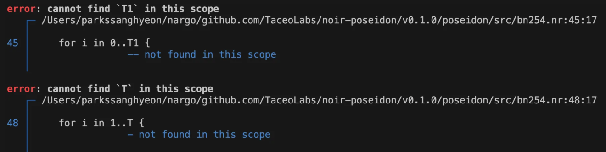
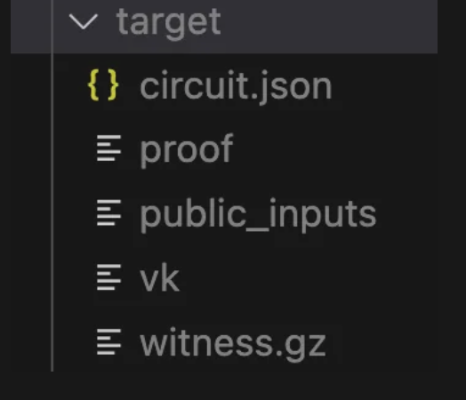
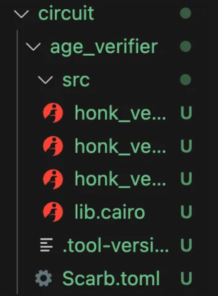
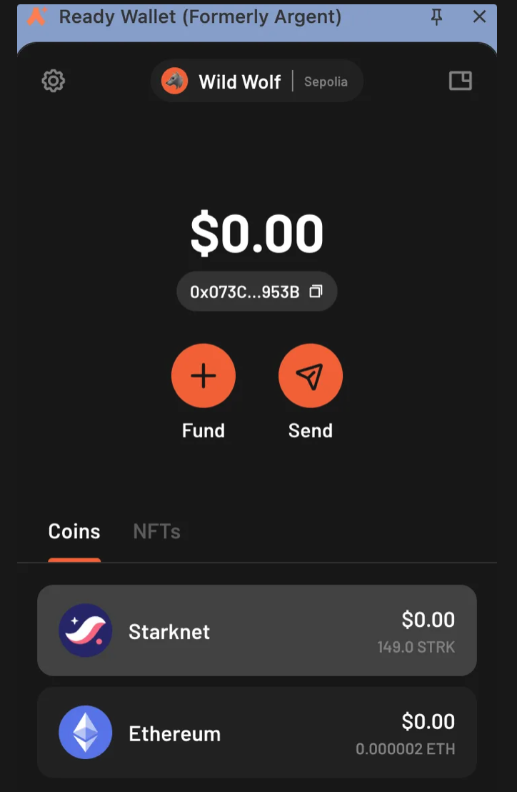
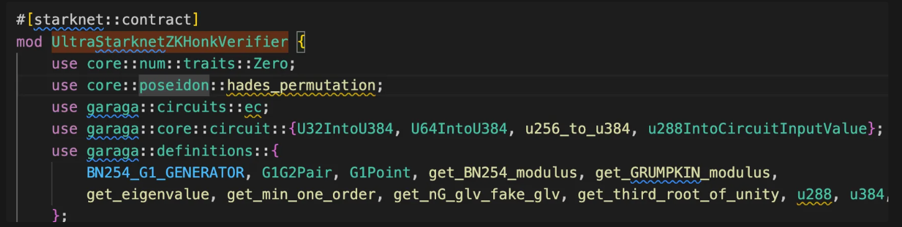
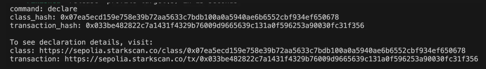
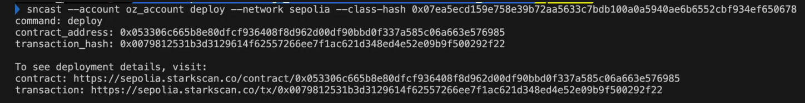
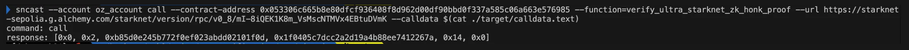

---

> Cairo만으로 나이검증 회로를 만들고 검증 컨트랙트를 starknet에 배포해 온체인 검증을 진행하는 것은 레퍼런스 부족 및 관련 툴과 관련된 이슈로 실패했다.

> 물론 검증 컨트랙트에서 proof의 길이 검사나 단순히 age, nonce, commitment를 받아 회로처럼 동작하도록 한다면 임의로 문제 해결이 가능했겠지만 문제에서 요구하는 사항이 아니기에 다른 방향으로 선회했다.

그러던 중 저번주 세션에서 noir 관련한 발표에서 noir를 사용한 verifier 생성과 관련된 발표와 다른분의 블로그 자료를 참고해 noir와 cairo 모두를 활용해 문제를 해결하기로 했다.

# Noir - circuit

Noir 설치 및 원하는 버전 업그레이드를 진행했다면 원하는 위치에 circuit/src/main.nr와 circuit/Nargo.toml 을 생성해준다. src 내부는 말 그대로 회로, toml은 해당 noir 프로젝트의 환경 설정 폴더와 같다.

우선 기존에 ciaro로 작성한 회로를 약간 수정해주어야 한다.

- 더미 연산 제거
- felt → uint 사용
- poseidon hash 라이브러리
- 나머지 부분: 기본적으로 rust 기반이기 때문에 문법은 모두 비슷하다.

poseidon hash부분: noir의 zk friendly poseidon hash 사용(https://github.com/TaceoLabs/noir-poseidon/tree/main/poseidon)

- poseidon `generic type T`가 현재 컴파일러에서는 금지된 Issue 존재
- 또한 해당 Poseidon 함수는 starknet의 poseidon 함수와는 라운드 및 상수등이 다름
  
  - 포크를 떠서 직접 모두 수정하거나 다른 poseidon 라이브러리로 대체해야 한다.

**그냥 std::hash의 Poseidon2를 사용하면 된다.**

```rust
use std::hash::poseidon2::Poseidon2::hash;
```

- commitment와 min_age는 public으로 외부에 공개되어야 한다.

```rust
// src/main.nr
use std::hash::poseidon2::Poseidon2::hash;

fn main(
    age: Field,
    nonce: Field,
    commitment: pub Field,
    min_age: pub Field,
) {
    let recomputed_commitment: Field = compute_commitment(age, nonce);
    println(recomputed_commitment);
    assert(recomputed_commitment == commitment, "Invalid commitment");

    assert(age as u32 >= min_age as u32, "Age is below the minimum age");
}

fn compute_commitment(age: Field, nonce: Field) -> Field {
    let inputs: [Field; 2] = [age, nonce];

    let commitment: Field = hash(inputs, 2);

    commitment
}
```

이후 `nargo compile` 실행 → circuit.json 생성

# Proof, Verifier 생성

생성한 circuit에서 우리는 proof를 생성할 수 있다.

우선 prover.toml에 input을 정의해야한다.

## Proof 생성

미리 commitment를 계산하는 부분은 아래에 간단하게 test 함수를 정의한 뒤 해당 test함수를 실행시켜 얻는다.

```rust
#[test]
fn test_compute_commitment() {
    let age: Field = 21;
    let nonce: Field = 1;

    let commitment: Field = compute_commitment(age, nonce);
    println(commitment);
}
```

```rust
nargo test --show-output
```

- 미리 input을 prover.toml에 정의해둔 뒤 input(proof)와 관련된 witness를 생성해야 한다.
  - commitment 값은 felt252 type 크기를 벗어나기 때문에 string으로 설정해야 한다.

```rust
// Prover.toml
age = 21
min_age = 20
nonce = 1
commitment = "0x1f0405c7dcc2a2d19a4b88ee7412267ab85d0e245b772f0ef023abdd02101f0d"
```

```rust
nargo execute witness
```

- 위 command를 입력하면 Prover.toml의 input과 관련된 witness가 생성이 된다.


이제 witness까지 만들었으니 아래의 command를 사용해 proof를 생성해주면 된다.

```rust
bb prove -s ultra_honk --oracle_hash starknet --zk -b target/circuit.json -w target/witness.gz -o target/
```



## Verification key

이제 proof를 검증해줄 회로에 맞는 verifer를 생성해야한다.

bb라는 **Barretenberg tool**을 사용해 바로 생성가능하다.

> bb는 **Barretenberg** 도구 체인의 커맨드라인 인터페이스 (CLI) 툴을 의미. 정확히는 barretenberg의 약자고, 이 툴은 **ZK 회로의 키 생성, 증명 생성, 검증 등 전체 프로세스를 다룰 수 있다.**

```rust
bb write_vk --scheme ultra_honk --oracle_hash keccak -b target/circuit.json -o target
```

- 위 command를 통해 Verification Key를 생성할 수 있게되고 이는 회로를 검증할때 사용하는 공개키이다.
  - ultra honk(zk-SNARK proving scheme)라는 프로토콜 사용
  - oracle hash로는 keccak사용

## Verifier contract

이제 vk를 활용해 검증에 사용할 컨트랙트를 생성해야 한다.

garaga를 통해 역시 간단하게 바로 생성 가능하다.

> garaga는 python version이 3.10. 이여야 생성 가능하다. 만약 다른 버전 ex) 3.12.를 사용하고 있다면 버전 변경 뒤 사용

```rust
1. which pyhon3
2. ls -l usr/local/bin/python3* // 만약 3.10 버전이 존재하지 않는다면 brew install.
3. ln -s -l usr/local/bin/python3.10 usr/local/bin/python3 // symbolic link 생성
4. // pip3 or pip 버전도 확인한 뒤 3.10에 맞춰서 변경 시키기. 위와 과정 동일
```

```rust
garaga gen --system ultra_starknet_zk_honk --vk target/vk
```

이후 위 command로 unchain verifier 컨트랙트를 만든다.

- **ultra_starknet_zk_honk**: ZK 인증시스템, Starknet 호환 zk-Honk system

# Proof 검증

Proof를 검증하기 전에 우선 위에서 생성한 veryfier contract를 onchain에 배포해야 한다.

## Verifier 컨트랙트 배포

우선 위에서 컨트랙트를 생성하며 생긴 snfoundry folder로 들어가줘야한다.



### import account

starknet sepolia 네트워크에 배포할 것이기 때문에 faucet을 받아놓은 지갑을 import 해준다.

- 여기서는 ready wallet을 사용, braavos 같은 다른 wallet도 가능.



- 지갑은 반드시 smart account가 배포되어있어야 한다.
  - 설정에 들어가 확인해보면 되고 만약 경고 표시와 함께 smart account가 배포가 되어있지 않다고 한다면 지갑 어플리케이션 내부에서 배포가 가능하다(gas fee는 지불해야 한다).
  - argent나 braavos는 서명 길이, 버전 호환등 자잘한 문제가 많음, **oz 사용 추천!!!**
  - 따로 계정 생성(oz)뒤 어플리케이션에서 private key로 import하는 방식으로 사용 추천

```rust
sncast account import --network sepolia --name myAccount \
--address {your account address} \
--private-key {your pv key} \
--type oz // smart account의 class hash에 따라서 다름.
```

지갑을 사용하기 위해서 프로젝트로 import 후 local에서 사용하기 위해 add profile 해준다.

```rust
sncast account import --add-profile myAccount1 \
--address {your account address} \
--type oz \
--url {rpc url}
```

이 과정까지 완료하면 toml 파일에 import한 지갑에 대한 profile이 생성되고 이제 사용이 가능하다.

### declare contract

이 전 글에서도 언급한 적이 있는데 starknet에서는 컨트랙트 배포를 위해 사전에 declare를 통해 starknet에 이런 컨트랙트가 있는다는 것을 알린 뒤 class-hash를 받아서 해당 class-hash를 통해 컨트랙트를 on-chain에 배포할 수 있다.

- 아니면 다른 사람이 declare한 컨트랙트의 class-hash만 받아서 바로 배포도 가능하다(동일한 기능일 경우).



우리가 배포할 검증 컨트랙트이다.

```rust
sncast --account myAccount declare --network sepolia \
--contract-name UltraStarknetZKHonkVerifier
```

sncast를 사용해 컨트랙트를 declare 한다.

output:



### deploy contact

위에서 얻은 class-hash를 사용해 이제 컨트랙트를 배포할 수 있다.

```rust
sncast --account oz_account deploy --network sepolia \
--class-hash 0x07ea5ecd159e758e39b72aa5633c7bdb100a0a5940ae6b6552cbf934ef650678
```



## Proof 검증 Tx call

우선 아까 생성한 proof와 public inputs을 기반으로 calldata를 생성해야 한다.

### calldata

garaga를 사용해 calldata를 생성할 수 있다.

```rust
garaga calldata --system ultra_starknet_zk_honk --proof target/proof --vk target/vk --public-inputs target/public_inputs > ./target/calldata.text
```

### call Tx

이제 sncast를 활용해 verifier contract에 검증 call을 쏠 수 있다.

```rust
sncast --account oz_account call \
--contract-address 0x053306c665b8e80dfcf936408f8d962d00df90bbd0f337a585c06a663e576985 \
--function=verify_ultra_starknet_zk_honk_proof \
--url https://starknet-sepolia.g.alchemy.com/starknet/version/rpc/v0_8/mI-8iQEK1K8m_VsMscNTMVx4EBtuDVmK \
--calldata $(cat ./target/calldata.text)
```



### response

응답 결과를 확인해보면 아래와 같다.

```rust
 [0x0, 0x2, 0xb85d0e245b772f0ef023abdd02101f0d, 0x1f0405c7dcc2a2d19a4b88ee7412267a, 0x14, 0x0]
```

- `verify_ultra_starknet_zk_honk_proof` 함수는 성공시 public input을 반환한다.
- 우리의 public input은 commitent와 min_age이다.
  - 0x14(20) ==min_age
  - 0x1f0405c7dcc2a2d19a4b88ee7412267a,0xb85d0e245b772f0ef023abdd02101f0d == commitment 값이다.
